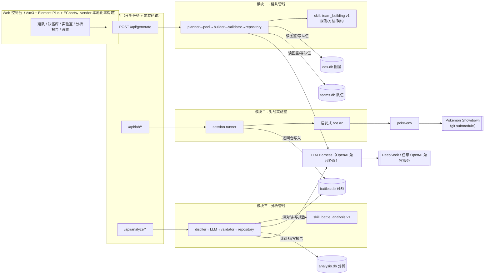

# Pokemon Battle Assistant · 宝可梦对战助手

LLM 驱动的宝可梦对战全流程助手：**AI 建队 → 自动对战跑量 → 智能复盘分析**。
一句话：告诉它你想要的队伍风格，AI 构筑合法队伍；两只 bot 在 Pokémon Showdown 引擎上自动打满 N 轮；分析 bot 读取全部对战数据，产出结构化复盘报告与改进建议。

## 功能总览

| 模块 | 功能 | 输入 → 输出 |
|---|---|---|
| **模块一 · AI 建队** | 自然语言需求 → 合法队伍（五阶段管线 + 规则校验） | "帮我建一支晴天进攻队" → 6 只完整配置队伍（存 teams.db） |
| **模块二 · 对战实验室** | 双 bot 自动对战跑量，逐回合采集 | 两支队伍 + 轮数 → 比分/胜率/回合分布/招式热榜（存 battles.db） |
| **模块三 · 分析 bot** | 战报蒸馏 → LLM 分析 → 反幻觉校验 | 一个对战会话 → 结构化复盘报告（评分/阵容表现/威胁/建议，存 analysis.db） |
| **Web 控制台** | 全流程可视化操作 | 建队任务轮询 / 队伍库管理 / 对战实时进度 / 报告结构化渲染 / API Key 在线配置 |

支持赛制：BSS（gen9bssregi，6选3单打 Lv50）、OU（gen9ou，6v6单打 Lv100）；VGC 双打建队可用，对战实验室二期开放。

## 架构



## 设计亮点

1. **Skill 版本化知识包**：赛制规则、建队/分析方法论、输出契约以版本目录管理（`skills/*/v1/`）；`rules.json` 一份两用——喂 LLM 的条款文本与校验器的机器约束同源，杜绝"讲的和查的不一致"。
2. **LLM Harness 极薄封装**：不依赖项目内任何模块，模块一/三原样复用；OpenAI 兼容协议（`POST {base_url}/chat/completions` + Bearer），换服务商只需改三项配置，Web 设置页在线热切换并即时测试连通。
3. **反幻觉三道闸**：结构校验（契约字段）→ 实体校验（报告里的宝可梦/招式/回合必须真实命中蒸馏数据）→ 不合格自动携带错误清单重试，杜绝 LLM 编造。
4. **数据蒸馏降本**：50 轮逐回合原始记录压缩为约 1 万字符的结构化摘要（出场档案/对位矩阵/采样时间线）再进 LLM，兼顾成本与分析质量。
5. **实测踩坑换来的防御性设计**：赛制一致性前置校验（Lv50 队打 Lv100 赛制会被服务器拒队挂死）、赛制白名单（未适配的路径直接 400，不再静默卡死）。
6. **全链路数据资产**：四库分工（图鉴/队伍/对战/分析）+ 报告 JSON/Markdown 双格式落盘，结论可追溯到每一场对战。

## 技术栈

- **后端**：Python 3.10+ / FastAPI / sqlite3（四库）
- **LLM**：OpenAI 兼容协议（默认 DeepSeek），httpx 直连无 SDK 依赖
- **对战引擎**：poke-env + Pokémon Showdown（submodule）
- **前端**：Vue3 + Vue Router + Element Plus + ECharts（全部 vendor 本地化，零构建零 node_modules）
- **测试**：pytest，38 个单测覆盖校验器/蒸馏器/仓储等核心组件

## 快速开始

环境要求：Python 3.10+、Node.js 18+（Showdown 引擎由 poke-env 本地拉起）、Git。

```bash
# 1. 克隆（含 Showdown submodule）
git clone --recurse-submodules <repo-url>
cd pokemon-battle-assistant

# 2. 安装依赖
python -m venv .venv
.venv\Scripts\activate        # Windows（Linux/macOS: source .venv/bin/activate）
pip install -r requirements.txt

# 3. 配置 LLM（任意 OpenAI 兼容服务商均可，也可启动后在"设置"页在线配置）
copy .env.example .env         # 编辑 .env 填入 OPENAI_API_KEY

# 4. 启动（数据随仓库自带，无需额外初始化）
start.bat                      # Windows 一键启动
# 或手动：python -m uvicorn pokemon_battle_assistant.api.app:app --app-dir src --port 8300
```

打开 http://127.0.0.1:8300 即可使用。

## 运行测试

```bash
pip install -r requirements-dev.txt
python -m pytest tests/ -q     # 38 passed
```

## 目录结构

```
pokemon-battle-assistant/
├── src/pokemon_battle_assistant/
│   ├── harness/        # LLM 封装（零项目依赖）
│   ├── skills/         # 版本化知识包（team_building / battle_analysis）
│   ├── team_builder/   # 模块一：建队管线
│   ├── lab/            # 模块二：对战会话/bot/采集
│   ├── battle_analyzer/# 模块三：蒸馏/校验/报告仓储
│   └── api/            # FastAPI 路由 + 静态前端
├── frontend/           # Vue3 控制台（vendor 本地化）
├── data/               # 四库 + 规则 + 分析报告文档
├── docs/               # 架构与模块设计文档
├── tests/              # 单测 + 手动冒烟脚本
├── pokemon-showdown/   # 对战引擎（submodule）
└── scripts/            # 数据库构建脚本
```

## 文档

- [模块一：AI 建队](docs/module1_team_builder.md)
- [模块二：对战实验室](docs/module2_battle_lab.md)
- [模块三：分析 bot](docs/module3_analysis_bot.md)
- [四库设计总览](docs/databases_overview.md)（dex / teams / battles / analysis 各有独立 schema 文档）
